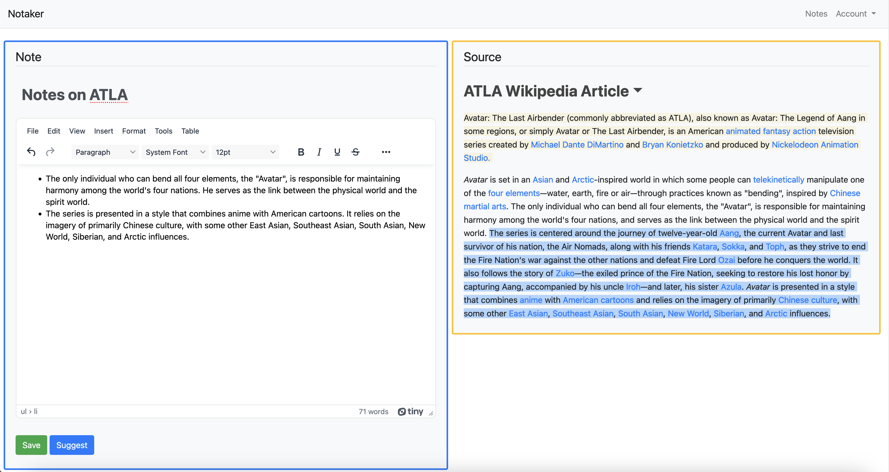

# Notaker

A simple note taking tool to make paraphrasing and summarizing information easier.

* Highlight a paragragh and `Suggest` to create a simple note paraphrasing the information
* Alternatively, click a sentence to only summarize that sentence

# Installation
1. Install Python from python.org/downloads/
2. Run `pip install -r requirements.txt`
3. Start a server by running `python manage.py runserver` in the `django_project` folder
